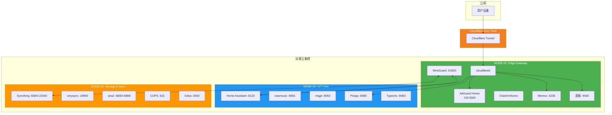
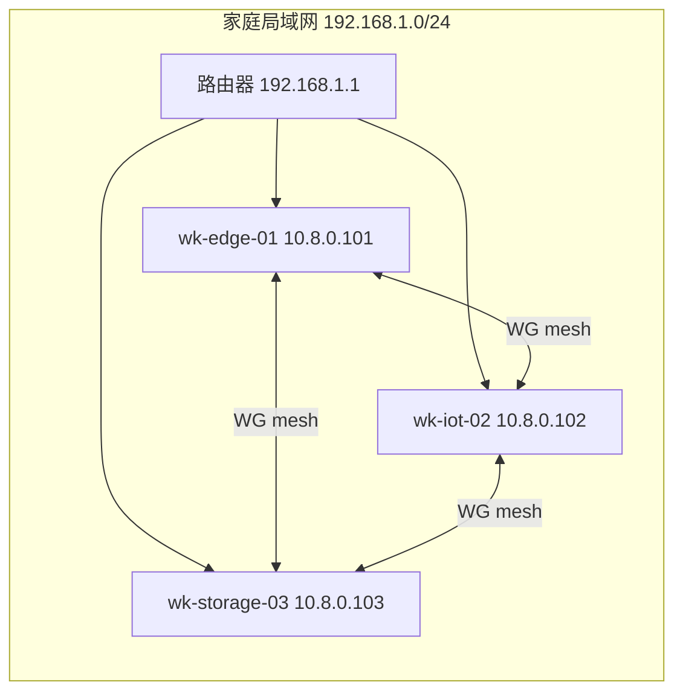

# 拓扑图文档

## 1. Mermaid 架构拓扑图

### 1.1 完整集群拓扑


### 1.2 网络层拓扑


## 2. ASCII 拓扑图

```
╔════════════════════════════════════════════════════════════════╗
║                    ONE CLOUD CLUSTER v1.0                       ║
║                                                                  ║
║   ┌──────────────────────────────────────────────────────────┐   ║
║   │                  Cloudflare Zero Trust                  │   ║
║   └──────────────────────────────────────────────────────────┘   ║
║                              │                                   ║
║                              ▼                                   ║
║   ┌─────────────────┐  WG MESH  ┌─────────────────┐              ║
║   │ NODE-01: EDGE   │◄──────────►│ NODE-02: IOT    │              ║
║   │ .101 / 10.8.0.101│           │ .102 / 10.8.0.102│              ║
║   │ cloudflared      │           │ Home Assistant   │              ║
║   │ AdGuard Home     │           │ Piwigo / Typecho │              ║
║   │ WireGuard        │           │ xiaomusic/migpt  │              ║
║   │ Memos/Clash      │           │                  │              ║
║   └────────┬─────────┘           └────────┬─────────┘              ║
║            └──────────┬──────────────────┘                       ║
║                       ▼                                          ║
║           ┌───────────────────────────┐                          ║
║           │ NODE-03: STORAGE & SYNC  │                          ║
║           │ .103 / 10.8.0.103        │                          ║
║           │ Syncthing / aria2        │                          ║
║           │ CUPS / Gitea / verysync  │                          ║
║           └───────────────────────────┘                          ║
╚════════════════════════════════════════════════════════════════╝
```
